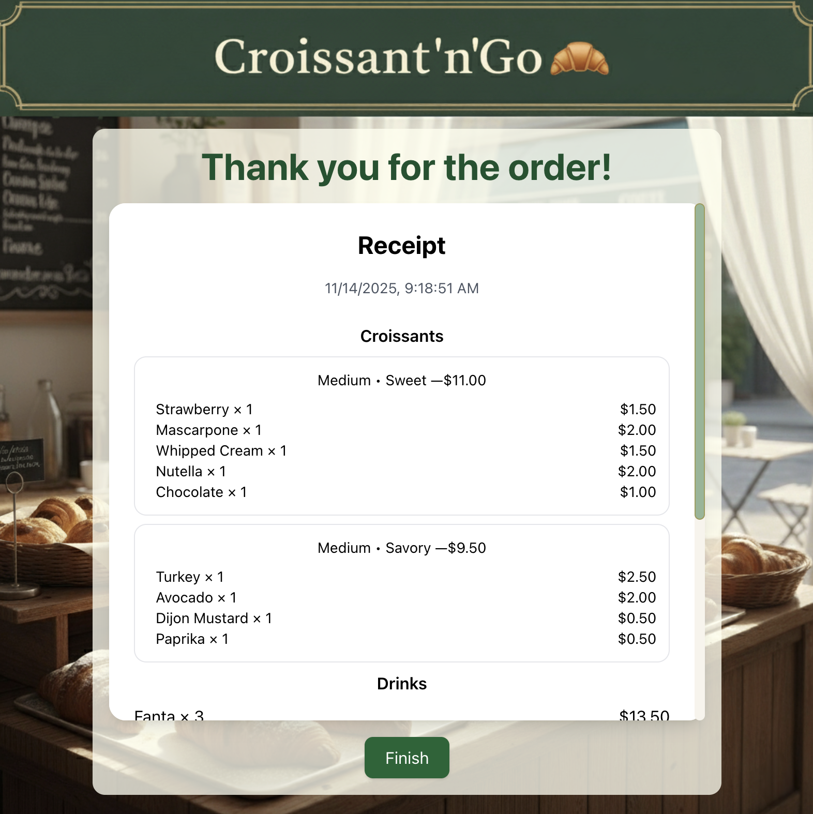
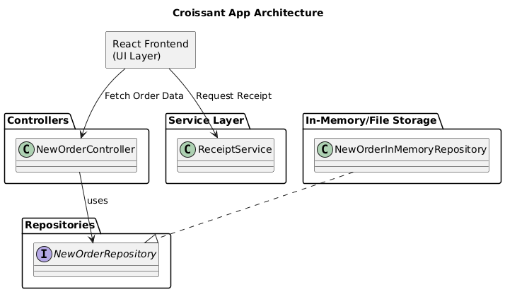
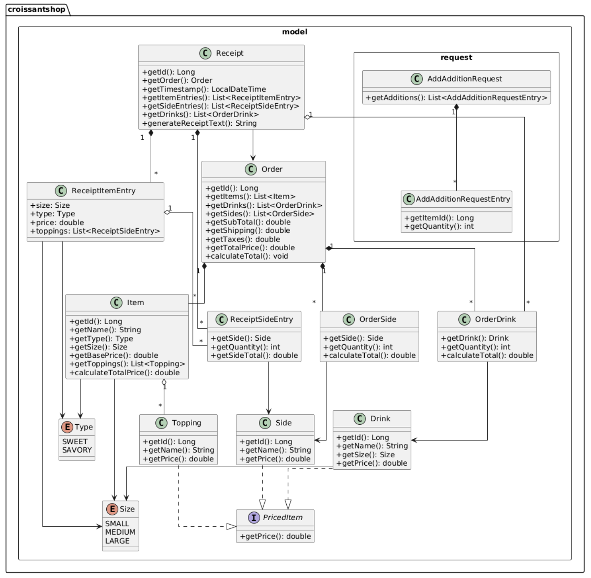
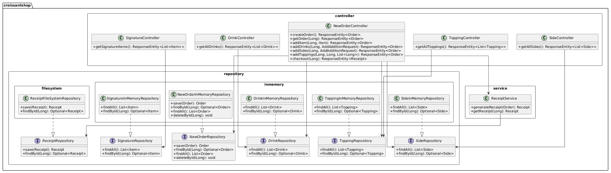

# 📌 Croissant'n'Go Shop 🥐
Croissant Shop Application is a full-stack web application designed to simulate the ordering process of a croissant.

---

## 📚 Table of Contents

* [📘 Overview](#-overview)
* [🚀 Features](#-features)
* [🔌 API Endpoints](#-api-endpoints)
* [📐 Project Architecture](#-project-architecture)
* [🧩 UML Diagram](#-uml-diagram)
* [🏗️ Technical Features](#-technical-features)
* [📊 Business Logic Features](#-business-logic-features)
* [▶️ Installation and Setup](#-installation-and-setup)
* [🎮 DEMO](#-demo)
* [👨‍💻 Author](#-author)

---

## 📘 Overview

The application consists of two primary parts:

 

1. **Spring Boot Backend** – provides RESTful APIs for managing menu items, orders, and receipts.
2. **[React Frontend](https://github.com/vita-sych/CroissantShop-Client)** – offers a responsive user interface for browsing the menu, customizing orders, and creating receipts.

---
## 🚀 Features

### **1. Order Management**
   - ✅ Create New Orders - Initialize a new order session
   - ✅ Add Items to Order - Build custom croissant orders
   - ✅ Modify Orders - Add drinks, sides, and toppings dynamically
   - ✅ Order Tracking - Retrieve order details by ID
   - ✅ Order Deletion - Remove orders from the system

### **2. Croissant Customization**
   - ✅ Signature Items - Pre-configured croissant combinations
   - ✅ Custom Croissants - Build your own croissant

   - ⚙️ **Type Selection:** Sweet or Savory
   - ⚙️ **Size Options:** Small, Medium, Large
   - ⚙️ **Multiple Toppings:** Add toppings per croissant
   - ⚙️ **Dynamic Pricing:** Automatic price calculation based on `base price` + `toppings price`

### **3. Menu Management**
   - ✅ View all available signature croissants, toppings, sides, and drinks
   - ✅ Add diffetent quantity of each item to an order

### **4. Order Additions**
   - ✅ **Add Drinks** - Specify drink ID and quantity
   - ✅ **Add Sides** - Specify side ID and quantity
   - ✅ **Add Toppings to Croissants** - Customize individual croissants with multiple toppings

### **5. Checkout & Receipt Generation**
   - ✅ **Order Checkout** - Finalize the order
   - ✅ **Automatic Receipt Generation** - Creates detailed receipt
    
   **Receipt Example:**
   

---
## 🔌 API Endpoints

| Method          | Endpoint                    | Description                           |
|-----------------|-----------------------------|---------------------------------------|
| 🟢 **GET**      | `/drinks`                   | Retrieve a list of all drinks         |
| 🟢 **GET**      | `/sides`                    | Retrieve a list of all sides          |
| 🟢 **GET**      | `/toppings`                 | Retrieve a list of all toppings       |
| 🟢 **GET**      | `/signatures?type=itemType` | Retrieve all signature croissants     |
| 🟢 **GET**      | `/toppings?type=itemType`   | Retrieve all signature croissants     |
| 🟢 **GET**      | `/new-order`                | Retrieve unfinished order             |
| 🟡 **POST**     | `/new-order`                | Submit a new order                    |
| 🟡 **POST**     | `/new-order/items`          | Add croissants to an existing order   |
| 🟡 **POST**     | `/new-order/drinks`         | Add drinks to an existing order       |
| 🟡 **POST**     | `/new-order/sides`          | Add sides to an existing order        |
| 🟡 **POST**     | `/new-order/receipt`        | Create a receipt to an existing order |
| 🔴 **DELETE**   | `/new-order/`               | Remove an item from an order          |

---
## 📐 Project Architecture



The architecture follows the Repository Pattern and Dependency Injection principles typical of Spring Boot applications, with clear separation of concerns between controllers, services, and data access layers.

*React Frontend* – handles the user interface and client-side logic.

*Spring Boot Backend* – exposes RESTful APIs that handle data retrieval, order processing, and receipt generation.

Communication between these two parts occurs over HTTP using REST APIs with JSON payloads.

---
## 🧩 UML Diagram

**Model & Request DTOs**



### **1. Model Layer** 
- **Enums**: `Type` (SWEET, SAVORY), `Size` (SMALL, MEDIUM, LARGE)
- **Interface**: `PricedItem` - implemented by `Drink`, `Side`, `Topping`
- **Core Entities**:
    - `Item` - represents croissants with toppings
    - `Drink` - beverages with size and price
    - `Side` - side dishes
    - `Topping` - croissant toppings
- **Order Management**:
    - `Order` - main order entity containing items, drinks, sides
    - `OrderDrink`, `OrderSide` - association classes with quantity
- **Receipt System**:
    - `Receipt` - order receipt with timestamp
    - `ReceiptItemEntry`, `ReceiptSideEntry` - receipt line items

### **2. Request DTOs** 
- `AddAdditionRequest` - request to add drinks/sides
- `AddAdditionRequestEntry` - individual addition entry

**Controllers & Services & Repositories**



### **3. Controller Layer**
- REST controllers for managing orders, drinks, sides, toppings, and signatures
- Each controller uses appropriate repositories

### **4. Service Layer**
- `ReceiptService` - generates and manages receipts

### **5. Repository Layer**
- **Interfaces**: Define data access contracts
- **In-Memory Implementations**: Store data in memory
- **FileSystem Implementation**: Persists receipts to text files

---
## 🏗️ **Technical Features**

### **Architecture Pattern**
- ✅ **Layered Architecture** - Controller → Service → Repository
- ✅ **Repository Pattern** - Abstract data access layer
- ✅ **Dependency Injection** - Spring-managed beans
- ✅ **RESTful API** - Standard HTTP methods and endpoints

### **Data Models**
- ✅ **Strong Type Safety** - Java enums for Type and Size
- ✅ **Lombok Integration** - Reduced boilerplate code
- ✅ **Builder Pattern** - Convenient object creation
- ✅ **PricedItem Interface** - Polymorphic pricing for menu items

---
## 📊 **Business Logic Features**

### **Pricing Calculations**
- ✅ **Base Price by Size** - Different prices for Small/Medium/Large
- ✅ **Topping Costs** - Each topping adds to item price
- ✅ **Quantity Multipliers** - Drinks and sides calculate: price × quantity
- ✅ **Sub Total** - Sum of all items, drinks, and sides
- ✅ **Shipping Fee** - Fixed $7.00 per order
- ✅ **Tax Calculation** - Percentage-based tax on subtotal
- ✅ **Order Total** - SubTotal + Shipping + Taxes

### **Order Validation**
- ✅ **Item Validation** - Ensure items exist before adding
- ✅ **Order State Management** - Track order lifecycle
- ✅ **Optional Patterns** - Safe null handling with Java Optional

---

## ▶️ **Installation and Setup**

1. **Clone the repository**
   ```bash 
    git clone https://github.com/yourusername/croissant-app.git
   ```
   ```bash 
   cd CroissantShop-Server
   ```

2. **Configure and Start Backend**
    
    Build the project using Maven:
    ```bash 
      mvn clean install
    ```

    Run the Spring Boot application:
    ```bash 
      mvn spring-boot:run
    ```

    The backend will be available at:
    ```bash 
      http://localhost:8080
    ```
3. **Configure and Start Frontend**
    ```bash 
    git clone https://github.com/yourusername/croissant-app.git
    ```
   ```bash 
   cd CroissantShop-Client
   ```
    Install dependencies:
    ```bash 
    npm install
    ```
    Start the development server:
    ```bash 
    npm run start
    ```
    The frontend will open at:
    ```bash 
    http://localhost:3000
    ```
---
### 🎮 DEMO

[Project DEMO](https://youtu.be/ClfqksxXEmM)

---
### 👩‍💻 Author
Vita Sych - [LinkedIn](https://www.linkedin.com/in/vita-sych/)